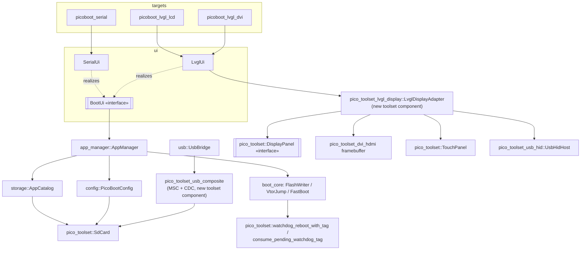
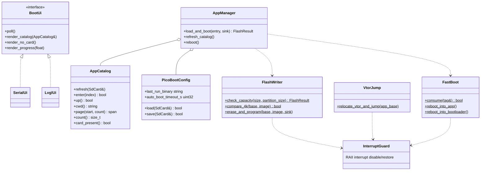
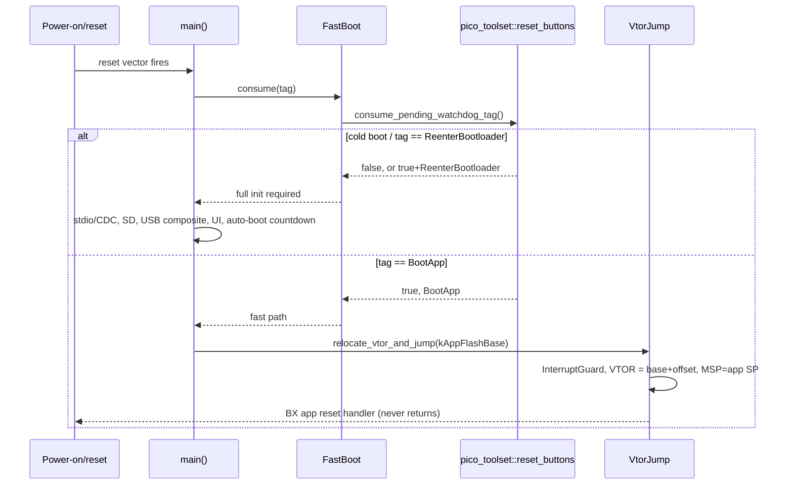

# PicoBoot architecture

See [`PicoBootloaderV2.md`](../PicoBootloaderV2.md) for the full specification this implements.

## Layers

```
targets/*  (compile-time UI selection: picoboot_serial, picoboot_lvgl_lcd, picoboot_lvgl_dvi)
    |
    v
ui  (BootUi interface: SerialUi, LvglUi)
    |
    v
app_manager  (orchestrates: load_and_boot(), refresh_catalog(), reboot())
    |
    +----------------+----------------+
    v                v                v
storage          config          boot_core
(AppCatalog)   (PicoBootConfig)  (FlashWriter, VtorJump, FastBoot)
    |                |                |
    v                v                v
pico_toolset::SdCard (read/write .cfg, list/read .bin)   pico_toolset::reset_buttons
                                                          (watchdog_reboot_with_tag /
                                                           consume_pending_watchdog_tag)

usb  (UsbBridge: MSC block device <-> SdCard raw diskio, CDC)
  -- runs independently alongside ui's poll loop, no dependency edge to app_manager
```

Dependencies flow strictly downward. `boot_core` never depends on SD/USB/UI — it
operates only on flash addresses and byte spans.

## Component diagram



## Class diagram (key classes)



## Fast-boot sequence



## Status

| Target | UI | Input | Flash (of 512 KB reserve) |
|---|---|---|---|
| `picoboot_serial` | serial (CDC) | terminal | ~110 KiB |
| `picoboot_lvgl_lcd` / `picoboot_lvgl_lcd_st7796` | LVGL on the external 3.5" 480x320 panel (ILI9486 / ST7796U, same header wiring; one `main.cpp`, built twice) + serial | touch, USB kbd/mouse/pad | ~377 KiB |
| `picoboot_lvgl_dvi` | LVGL on HDMI/DVI (320x240) + serial | USB keyboard / mouse / gamepad (PIO-USB host) | ~378 KiB |

Boards are selected at configure time (`-DPICOBOOT_BOARD=...`, one build directory each):

| Board | Chip | Targets | Input | Flash / RAM used |
|---|---|---|---|---|
| `waveshare_pizero` (default) | RP2350 | serial, LCD (external ILI9486 / ST7796U), HDMI | touch + USB kbd/mouse/pad (LCD); USB kbd/mouse/pad (HDMI) | up to 378 KiB / 321 KiB of 520 KiB |
| `crowpanel_pico_hmi_28` | RP2040 | serial, LVGL on the built-in ST7789 | touch | 365 KiB / 117 KiB of 264 KiB |
| `pico_dv` (Pico W on Pico DV) | RP2040 | serial, LVGL on HDMI (320x240 **RGB332**, half the RAM) | 3 buttons as keypad (A down, B up, C select; GPIO 14/15/16, polarity auto-detected) | 366 KiB / 186 KiB of 264 KiB |

Pico DV HDMI output and 252 MHz on RP2040 are validated on hardware. CrowPanel: the SD card, panel and touch share SPI1, whose clock the
display/touch drivers change -- the target restores the SD clock after every
screen/touch access (`release_bus_and_pump_usb`).

All builds expose USB CDC serial + MSC (the SD card) + the picotool reset
interface (`picotool reboot -f -u` / `load -f` work without BOOTSEL; PID
0x000A so picotool's stock udev rules apply). Each bootloader links against
a FLASH region limited to the reserve, so growing past 512 KB fails at link
time. Default build type is MinSizeRel (LVGL at -O3 was 545 KB).

USB stacks: the device stack (MSC+CDC, native port) and the PIO-USB host
(HID) share one TinyUSB build, hence one `tusb_config.h`; the composite has
a device-only and a `_hid` variant built against the matching config.

Application images are inspected before flashing (`image_check`, from the
raw `.bin`): size against the partition; the **chip family** (RP2040: the
256-byte boot stage's CRC32; RP2350: the picobin image-definition block in
the first 4 KiB, which also gives the CPU, so RISC-V images are refused); the
vector table (SP in SRAM, thumb reset vector); and the **link address** from
the reset vector -- inside the partition (runs where it is flashed) or at
`0x10000000` (a normal build). Normal builds run on **RP2350** through flash
address translation (below); on RP2040 they are refused with an explanation.
Every refusal produces a long message (serial) and a short one (screen). The image is
**streamed** from the SD card in 16 KiB blocks (RAM use is one block, so
large applications fit the RP2040's 264 KB): each 4 KiB sector is compared
with flash and only differing sectors are erased/programmed, so re-loading an
identical image writes nothing. Each block is programmed in its own critical
section (a video core registered as a `flash_safe_execute` victim is parked
one block at a time); failures are reported and never booted.

Test applications (`testapps/`): `app_blink`, `app_reboot_to_bootloader`,
`app_normal_build` (runs on RP2350 via address translation; refused on RP2040).

## Storage: the card, the USB drive and the loader

Two things use the same card: the USB host (raw 512-byte sectors through
`disk_read`/`disk_write`) and the bootloader (FatFs, read-only apart from
`picoboot.cfg`). They are **not kept coherent live**; the bootloader remounts on
Refresh. What keeps this safe:

- **Write lock while loading** (`storage_state`): the drive answers write
  commands with "write protected" for the duration of a load, so nothing changes
  under the file being streamed. Reads stay allowed.
- **Real medium state.** The drive probes the card (a capacity command, at most
  once a second) instead of trusting the mounted flag; three consecutive I/O
  errors, or a failed probe, mark the card gone until Refresh. The host is told
  (UNIT ATTENTION "media may have changed") only when the card was gone, appeared,
  or changed capacity, or after a host eject -- never on a plain Refresh, so a copy
  in progress is not disturbed.
- **Durability.** SYNCHRONIZE CACHE and eject wait for the card to finish
  programming (`CTRL_SYNC`) before answering, and the loader syncs before
  resetting into the app.
- **Capacity is cached** per medium (hosts ask constantly); an unreadable capacity
  is never cached and is reported as "medium not present", not as zero blocks.
- **Errors reported to the host are coarse:** TinyUSB 0.18 forces the sense data
  "medium not present" on any failed READ/WRITE(10) callback, so the host cannot
  tell an I/O error from a removal.
- **Folders**: the catalog lists one directory (folders first, max 512 entries), the UIs navigate with
  `enter`/`up` (each remounts and re-lists). `last_run` is a path from the root and the first listing starts
  in its folder, falling back to the root if it is gone. The USB drive needs nothing: the host's file system
  manages folders itself.
- **picoboot.cfg** is only rewritten when `last_run` changed, and a failed write is
  reported on serial.

The bootloader's file access goes through the FatFs stdio shim (open/read/write/
seek/stat/fstat; **no** delete, rename, mkdir or truncate) with `errno` mapped
from the FatFs result and permission bits from the FAT read-only attribute. The
FatFs configuration is generated from the fetched one with **UTF-8 names and code
page 850** (the default 932 cost ~55 KB of tables). Directory listings come from one
pass over the directory (names and sizes together) and are capped at 512 entries.

Core 0's stack is 4 KiB (the default 2 KiB was tight for FatFs + printf + LVGL); the
HDMI targets do not reserve a default core-1 stack because the video code supplies
its own. `info` on the serial console reports the stack and heap headroom.

## Running normal builds on RP2350 (address translation)

The RP2350's flash controller (`QMI_ATRANSn`) can remap 4 MiB windows of the XIP
address space onto other physical flash addresses. To start a normal build
(linked at `0x10000000`) that was flashed at the partition, the bootloader
(1) reads the app's SP/reset vector through the physical address, (2) from a
RAM-resident stub programs windows 0..3 so virtual `0x10000000..` maps to
physical `0x10080000..` (chained 4 MiB windows, 1024 x 4 KiB pages each), (3)
invalidates the XIP cache (it is virtually addressed), (4) sets `VTOR` to
`0x10000000`, and (5) branches. The stub must run from RAM because the
bootloader's own code disappears from the window at step 2. The launch is a
tag (`BootTag::kBootAppRemapped`) consumed at the top of `main()` after the
watchdog reset, like the ordinary one; the mapping is reset by the next reset.

Flash *programming* is not translated: an app that writes flash at low
physical offsets would overwrite the bootloader (documented in the README).
RP2040 has no such mechanism, hence the refusal there.

## Flash partition offset

`kAppFlashBase = 0x10080000` (512KB reserved for the bootloader, `0x10000000`
XIP base + `0x80000`). This is generously sized for the *largest* PicoBoot
variant (`picoboot_lvgl_dvi`), not the smallest, because every target app is
compiled once against this fixed origin regardless of which bootloader
variant flashed it. Measured so far: `picoboot_serial` uses ~56KB of the
512KB reserve (Phase 1 skeleton, before SD/USB/LVGL are added) — comfortable
margin. Revisit at Phase 7 once a real `picoboot_lvgl_dvi` image exists.
Single source of truth: [`cmake/picoboot_flash_layout.cmake`](../cmake/picoboot_flash_layout.cmake),
consumed by [`boot_core/include/picoboot/flash_layout.h.in`](../boot_core/include/picoboot/flash_layout.h.in)
and every testapp's linker override.

### App vector table offset (chip-dependent, verified on RP2350)

Apps are built with pico-sdk's standard `pico_standard_link` flow, just with
`FLASH`'s `ORIGIN` overridden to `kAppFlashBase`. On **RP2350**, this was
verified on a real built `testapps/app_blink.bin`: the vector table (a
plausible RAM stack pointer followed by a matching reset handler address)
sits at **offset 0** from the app's flash base — pico-sdk does not force-link
a `.boot2` stub for this chip (its `.boot2` section is optional and
discarded when unreferenced, unlike RP2040's, which is always exactly 256
bytes and force-linked for any flash build). Since an app loaded via
PicoBoot's VTOR relocation is never cold-booted by the on-chip ROM (only
warm-jumped into from the already-running bootloader), boot2 -- present or
not -- is unused either way; the only thing that matters is matching wherever
the linker actually placed the vector table. See
[`boot_core/src/vtor_jump.cpp`](../boot_core/src/vtor_jump.cpp)'s
`kVectorTableOffset`. **The RP2040 branch (offset `0x100`) is not yet
hardware-verified** — re-check the same way (inspect a real built `.bin`)
during Phase 8's RP2040 bring-up before relying on it.

## Toolset reuse

Reused as-is from Pico-Toolset: `pico_toolset_sdcard`, `pico_toolset_reset_buttons`,
`pico_toolset_fault_handler`, the SPI display drivers (`ili9486`/`st7789`/`st7796`/`xpt2046`)
and `dvi_hdmi`. Net-new, proposed as Pico-Toolset contributions once
hardware-proven: `pico_toolset_usb_composite` (Phase 4) and
`pico_toolset_lvgl_display` (Phase 6/7). Net-new, PicoBoot-only: everything
under `boot_core/`, `config/`, `storage/`, `app_manager/`, `ui/` (safety-critical
or bootloader-specific business logic that doesn't belong in a shared driver
library). See the repo's phased delivery plan for the full 9-phase breakdown.
