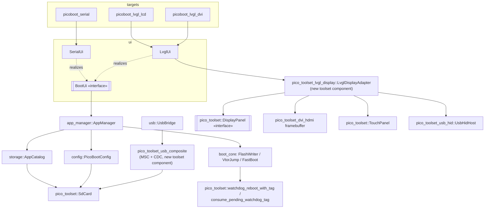
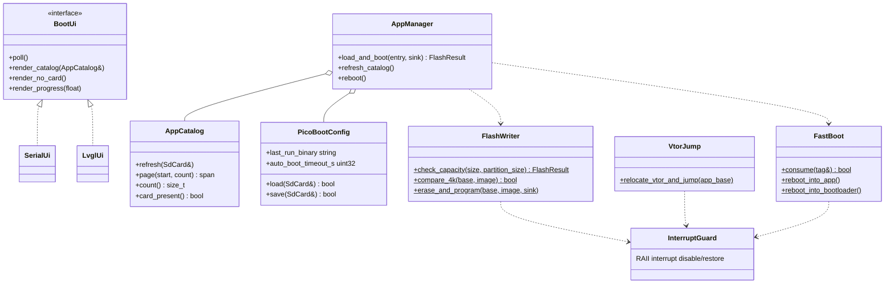
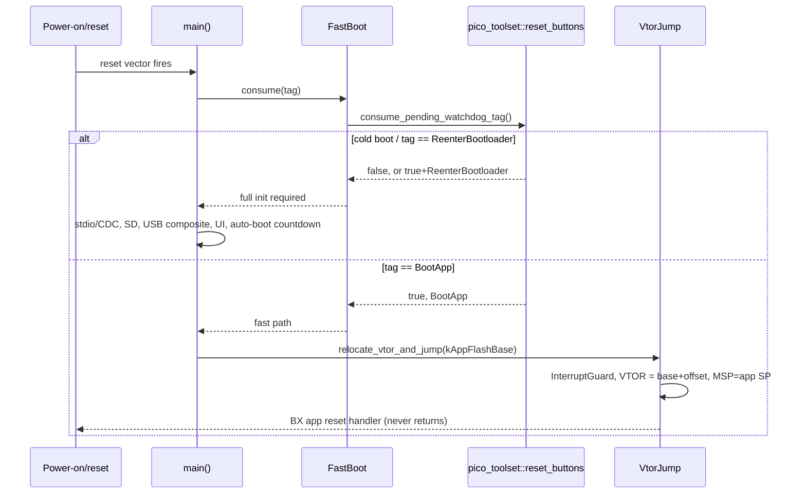

# PicoBoot architecture

See [`PicoBootloaderV2.md`](../PicoBootloaderV2.md) for the full specification this implements.

## Layers

```
targets/*  (compile-time UI selection: picoboot_serial, picoboot_lvgl_lcd, picoboot_lvgl_dvi)
    |
    v
ui  (BootUi interface: SerialUi, LvglUi)
    |
    v
app_manager  (orchestrates: load_and_boot(), refresh_catalog(), reboot())
    |
    +----------------+----------------+
    v                v                v
storage          config          boot_core
(AppCatalog)   (PicoBootConfig)  (FlashWriter, VtorJump, FastBoot)
    |                |                |
    v                v                v
pico_toolset::SdCard (read/write .cfg, list/read .bin)   pico_toolset::reset_buttons
                                                          (watchdog_reboot_with_tag /
                                                           consume_pending_watchdog_tag)

usb  (UsbBridge: MSC block device <-> SdCard raw diskio, CDC)
  -- runs independently alongside ui's poll loop, no dependency edge to app_manager
```

Dependencies flow strictly downward. `boot_core` never depends on SD/USB/UI — it
operates only on flash addresses and byte spans.

## Component diagram



## Class diagram (key classes)



## Fast-boot sequence



## Status

| Target | UI | Input | Flash (of 512 KB reserve) |
|---|---|---|---|
| `picoboot_serial` | serial (CDC) | terminal | ~157 KB |
| `picoboot_lvgl_lcd` | LVGL on ILI9486 3.5" + serial | touch | ~405 KB |
| `picoboot_lvgl_dvi` | LVGL on HDMI/DVI (320x240) + serial | USB keyboard / mouse / gamepad (PIO-USB host) | ~434 KB |

Boards are selected at configure time (`-DPICOBOOT_BOARD=...`, one build directory each):

| Board | Chip | Targets | Input | Flash / RAM used |
|---|---|---|---|---|
| `waveshare_pizero` (default) | RP2350 | serial, LCD (external ILI9486), HDMI | touch (LCD); USB kbd/mouse/pad (HDMI) | up to 434 KB / 327 KB of 520 KB |
| `crowpanel_pico_hmi_28` | RP2040 | serial, LVGL on the built-in ST7789 | touch | 420 KB / 114 KB of 264 KB |
| `pico_dv` (Pico W on Pico DV) | RP2040 | serial, LVGL on HDMI (320x240 **RGB332**, half the RAM) | 3 buttons as keypad (provisional pins 7/9/20) | 419 KB / 189 KB of 264 KB |

Hardware still to validate: Pico DV button pins and HDMI output, and 252 MHz on
RP2040. CrowPanel: the SD card, panel and touch share SPI1, whose clock the
display/touch drivers change -- the target restores the SD clock after every
screen/touch access (`release_bus_and_pump_usb`).

All builds expose USB CDC serial + MSC (the SD card) + the picotool reset
interface (`picotool reboot -f -u` / `load -f` work without BOOTSEL; PID
0x000A so picotool's stock udev rules apply). Each bootloader links against
a FLASH region limited to the reserve, so growing past 512 KB fails at link
time. Default build type is MinSizeRel (LVGL at -O3 was 545 KB).

USB stacks: the device stack (MSC+CDC, native port) and the PIO-USB host
(HID) share one TinyUSB build, hence one `tusb_config.h`; the composite has
a device-only and a `_hid` variant built against the matching config.

Application images are checked before flashing: size against the partition,
and (`image_check`) that the initial SP points into SRAM and the reset
vector into the application partition -- rejects apps linked for the
default 0x10000000 layout (`testapps/app_wrong_offset`). The image is
**streamed** from the SD card in 16 KiB blocks (RAM use is one block, so
large applications fit the RP2040's 264 KB): each 4 KiB sector is compared
with flash and only differing sectors are erased/programmed, so re-loading an
identical image writes nothing. Each block is programmed in its own critical
section (a video core registered as a `flash_safe_execute` victim is parked
one block at a time); failures are reported and never booted.

Test applications (`testapps/`): `app_blink`, `app_reboot_to_bootloader`,
`app_wrong_offset` (must be rejected).

## Known limitation

RP2040-vs-RP2350 architecture compatibility of a loaded `.bin` is **not**
verified (explicit scope decision) — the checks are file size against the
partition and the vector-table sanity check above, which cannot tell chip
families apart. A raw, metadata-free `.bin` carries no chip-family marker, and
adding one would require a header/trailer format or a filename convention,
both rejected in favor of pure `.bin` passthrough. Mitigation: a given
physical unit's bootloader is itself built for one specific chip, so in
normal operation a user only copies binaries built for that chip onto that
unit's card.

## Flash partition offset

`kAppFlashBase = 0x10080000` (512KB reserved for the bootloader, `0x10000000`
XIP base + `0x80000`). This is generously sized for the *largest* PicoBoot
variant (`picoboot_lvgl_dvi`), not the smallest, because every target app is
compiled once against this fixed origin regardless of which bootloader
variant flashed it. Measured so far: `picoboot_serial` uses ~56KB of the
512KB reserve (Phase 1 skeleton, before SD/USB/LVGL are added) — comfortable
margin. Revisit at Phase 7 once a real `picoboot_lvgl_dvi` image exists.
Single source of truth: [`cmake/picoboot_flash_layout.cmake`](../cmake/picoboot_flash_layout.cmake),
consumed by [`boot_core/include/picoboot/flash_layout.h.in`](../boot_core/include/picoboot/flash_layout.h.in)
and every testapp's linker override.

### App vector table offset (chip-dependent, verified on RP2350)

Apps are built with pico-sdk's standard `pico_standard_link` flow, just with
`FLASH`'s `ORIGIN` overridden to `kAppFlashBase`. On **RP2350**, this was
verified on a real built `testapps/app_blink.bin`: the vector table (a
plausible RAM stack pointer followed by a matching reset handler address)
sits at **offset 0** from the app's flash base — pico-sdk does not force-link
a `.boot2` stub for this chip (its `.boot2` section is optional and
discarded when unreferenced, unlike RP2040's, which is always exactly 256
bytes and force-linked for any flash build). Since an app loaded via
PicoBoot's VTOR relocation is never cold-booted by the on-chip ROM (only
warm-jumped into from the already-running bootloader), boot2 -- present or
not -- is unused either way; the only thing that matters is matching wherever
the linker actually placed the vector table. See
[`boot_core/src/vtor_jump.cpp`](../boot_core/src/vtor_jump.cpp)'s
`kVectorTableOffset`. **The RP2040 branch (offset `0x100`) is not yet
hardware-verified** — re-check the same way (inspect a real built `.bin`)
during Phase 8's RP2040 bring-up before relying on it.

## Toolset reuse

Reused as-is from Pico-Toolset: `pico_toolset_sdcard`, `pico_toolset_reset_buttons`,
`pico_toolset_fault_handler`, the SPI display drivers (`ili9486`/`st7789`/`st7796`/`xpt2046`)
and `dvi_hdmi`. Net-new, proposed as Pico-Toolset contributions once
hardware-proven: `pico_toolset_usb_composite` (Phase 4) and
`pico_toolset_lvgl_display` (Phase 6/7). Net-new, PicoBoot-only: everything
under `boot_core/`, `config/`, `storage/`, `app_manager/`, `ui/` (safety-critical
or bootloader-specific business logic that doesn't belong in a shared driver
library). See the repo's phased delivery plan for the full 9-phase breakdown.
